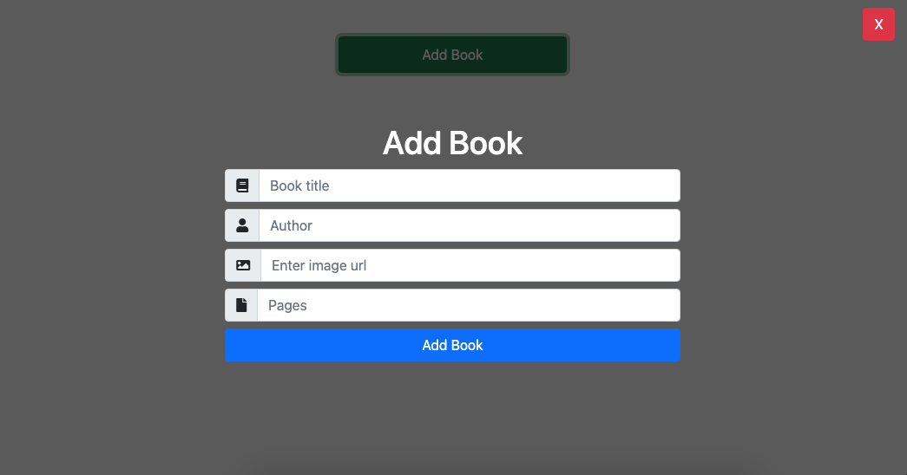
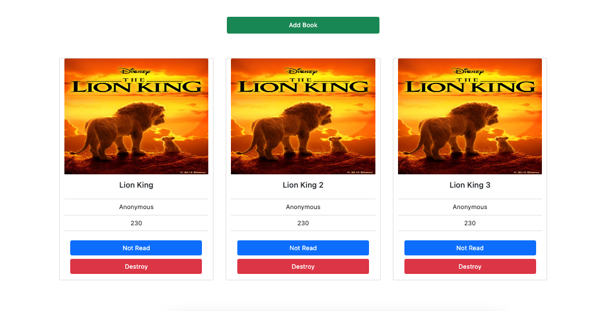

# MyLibraryAppV1

In this project, we built a basic web based library appliction using JavaScript. One can add books to the library, delete the books and mark the book as read. We use local storage to store the data from the user.




## Built With

- JavaScript
- Html
- Bootstrap

### System requirements

- Web Browser

## Getting Started

To get a local copy of the repository please run the following commands on your terminal:

```
$ cd <folder>
```

```
$ git clone https://github.com/garciajordy/LibraryAppV1.git
```

```
$ cd LibraryAppV1
```

## Authors

👤 **Jordy Garcia**

- Github: [@garciajordy](https://github.com/garciajordy)
- Email: [jordygarcia0119@gmail.com](https://mail.google.com/mail/?view=cm&source=mailto&to=jordygarcia0119@gmail.com)
- LinkedIn: [Jordy Garcia](https://www.linkedin.com/in/jordygarcia/)

👤 **Malieze Afam Ifeanyi**

- GitHub: [@chrystalme](https://github.com/chrystalme)
- Twitter: [@afam_ifeanyi](https://twitter.com/afam_ifeanyi)
- LinkedIn: [Malieze Afam Ifeanyi(chrys)](https://linkedin.com/in/afam-chrys)

## 🤝 Contributing

Contributions, issues, and feature requests are welcome!

Feel free to check the [issues page](https://github.com/garciajordy/LibraryAppV1/issues).

## Show your support

Give a ⭐️ if you like this project!

## Acknowledgments

- [Odin Projects](https://www.theodinproject.com/courses/)
- [Microverse](https://microverse.com)

## 📝 License

This project is [MIT](https://mit-license.org/) licensed.
